# Mowen AI Editor · 墨问 AI 小说编辑器

**基于 LangGraph 多智能体编排的 AI 小说协同创作平台**

[](https://github.com/wanghaoyi216/Mowen-AI-Editor/stargazers)
[](https://github.com/wanghaoyi216/Mowen-AI-Editor/network)
[](LICENSE)
[](https://www.python.org)
[](https://www.typescriptlang.org)
[](https://fastapi.tiangolo.com)
[](https://react.dev)
[](https://github.com/langchain-ai/langgraph)

---

## 🎯 项目简介

**墨问 AI 小说编辑器** 是一个面向长篇网络小说的 **AI 协同创作平台**。

输入一个书名和大纲，平台即可自动完成从**世界观构建** → **章节规划** → **正文写作** → **一致性审校**的全流程。系统基于 LangGraph StateGraph 编排多个 SubAgent 并行工作，支持 45+ 章超长篇小说的连贯生成，前端提供 6 套水墨主题自定义界面，任务全程断点续跑不怕丢稿。

> 不是聊天框，是真正的 **AI 小说写作操作系统**。

---

## ✨ 核心能力

| 🧠 1M 上下文 | 🔄 断点续跑 | 📡 实时事件流 | 🎨 6 套水墨主题 | 🕸️ Neo4j 知识图谱 |
|:---:|:---:|:---:|:---:|:---:|
| 一次喂完 45+ 章设定 | 进程崩了不丢稿 | SSE 推送每个 token | 水墨风自定义 + 颜色提取 | 角色/事件/地点关系网 |

---

## 📸 功能展示

### 用户认证


简洁的 JWT 认证登录界面，支持账号注册。


---

### 创作工作流

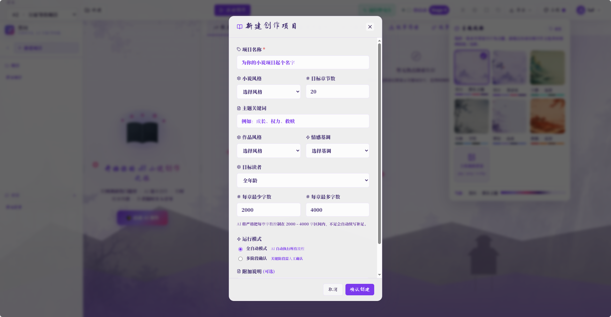

新建项目时输入书名、简介、目标章节数，系统自动规划创作路径。

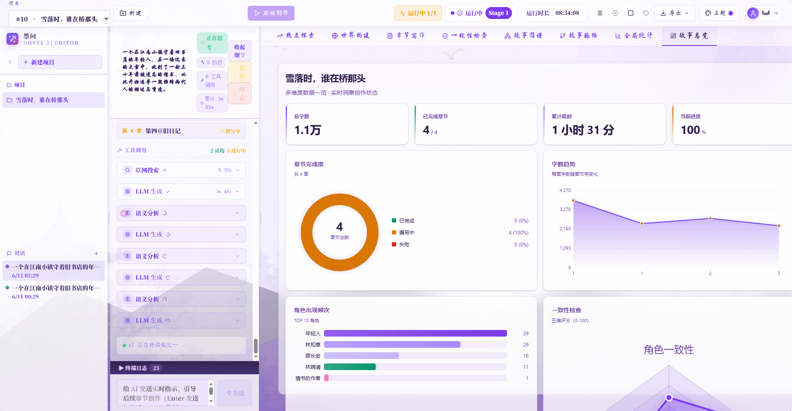

项目总览页面展示基本信息、章节进度条和当前任务状态。

---

### 热点灵感搜索

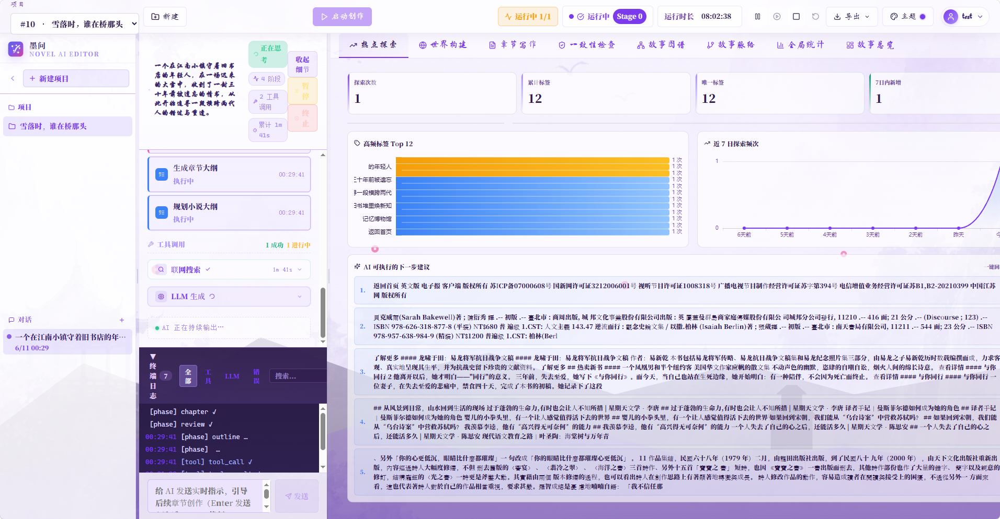

输入题材/关键词，自动调用大模型搜索平台热点趋势，生成创作灵感报告。

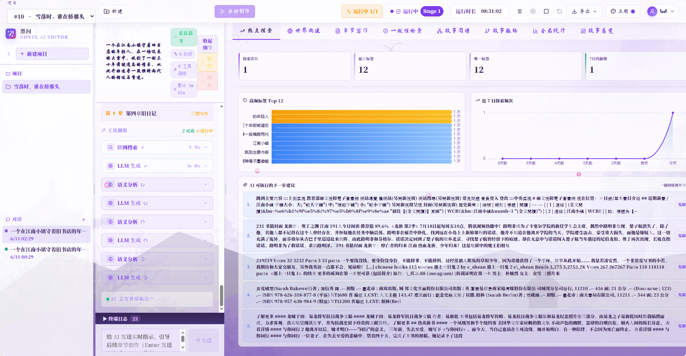

---

### 章节写作（核心功能）


逐章生成正文，AI 实时流式输出每个 token，用户可随时中断、修改、触发重写。

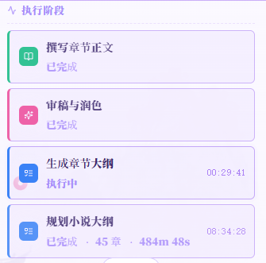

任务进度条实时显示 Phase 1（大纲规划）/ Phase 2（章节生成）/ Phase 3（一致性审校）三个阶段的执行状态。

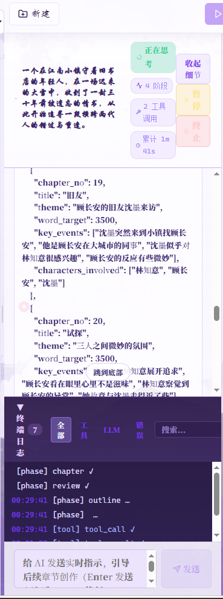

展示 Plan-and-Execute 工作流的每一步骤执行结果，包含生成的章节计划、人物设定、世界观设定。

---

### 一致性审校

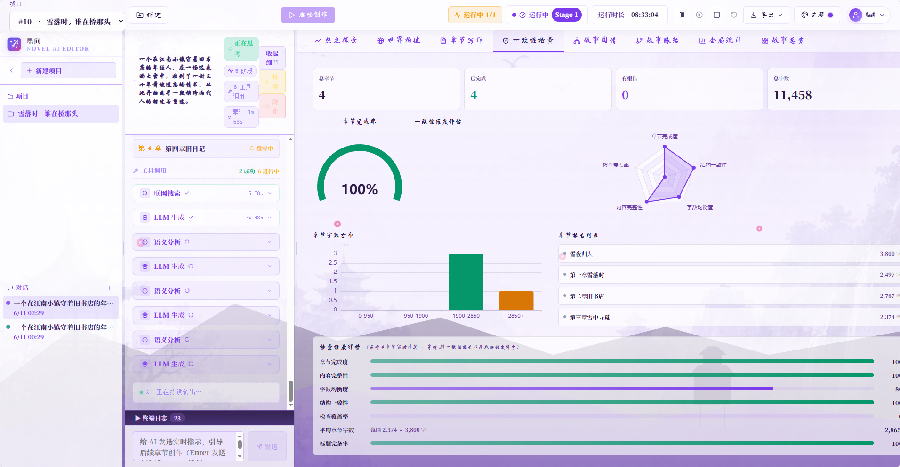

大模型自动审查已完成章节与世界观/人物设定的一致性，生成审校报告并支持一键修复。

---

### 故事脉络

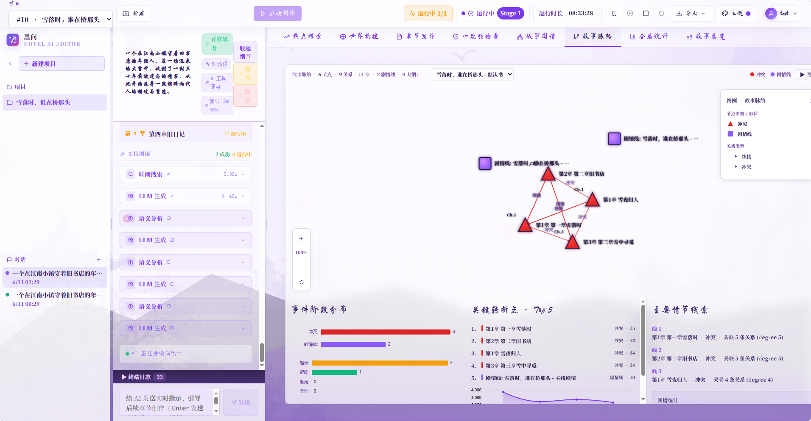

时间线视图展示故事事件顺序和章节分布，帮助作者把控整体叙事节奏。

---

### 知识图谱

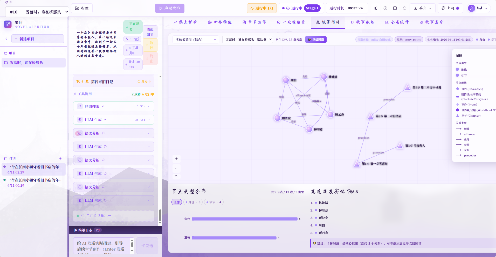

基于 Neo4j 构建角色、事件、地点、势力之间的多对多关系网络。章节生成时自动查询前文相关节点作为上下文，解决大模型长期记忆失效问题。

---

### 主题系统

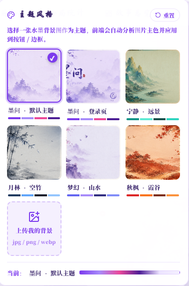

6 套预设水墨主题（墨韵默认 / 青玉 / 月竹 / 梦墨 / 朱枫 / 自定义上传），上传背景图后自动提取主色作为界面 CSS 变量，沉浸式写作体验。

---

### 任务与统计

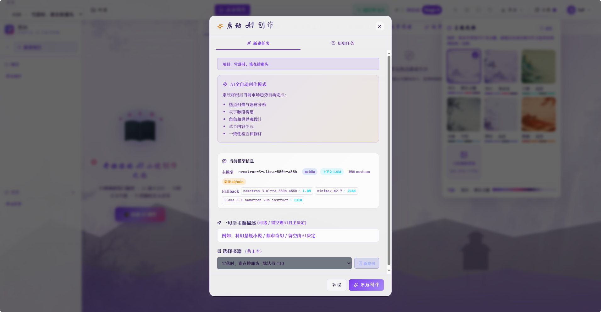

手动创建新任务，可指定章节范围、工作流类型和优先级。

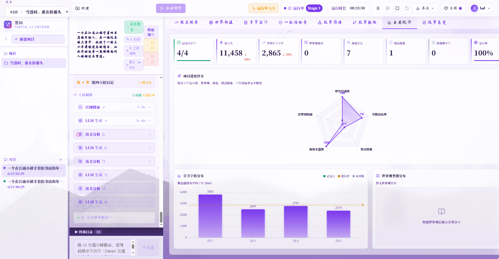

LLM Token 消耗统计、章节字数排行、任务成功率大盘。

---

## 🎯 核心技术亮点

### 1. LangGraph StateGraph 编排的并行 SubAgent 架构

章节生成是整个系统最核心的链路。[chapter_loop_service.py](backend/app/services/chapter_loop_service.py) 使用 **LangGraph StateGraph** 编排多个 SubAgent 并行执行：

```
Plan Chapter
    │
    ├──→ Character Design ──┐
    ├──→ Plot Design ──────┼──→ Draft ──→ Consistency Review
    └──→ Worldbook Check ──┘              │
                                           ├──→ failed → Revise → Draft (ReAct 循环)
                                           └──→ passed → Store Chapter
```

- **并行 SubAgent**：角色设计、剧情设计、世界观一致性检查三个 Agent 同时跑，结果 join 后进入正文生成阶段
- **ReAct 反思循环**：初稿生成 → 审校 → 发现不一致 → 反思 → 重写，最多 N 轮直到通过
- **Conditional Branch**：审校失败自动进入 revise 节点，无需人工干预

### 2. Plan-and-Execute 注册式工作流系统

[workflow_registry_service.py](backend/app/services/workflow_registry_service.py) 实现注册式工作流设计，新增工作流只需在配置文件加一行，无需改动前端代码：

| ID | 名称 | 说明 |
|---|---|---|
| `wf-01` | 热点搜索 | Plan → Search → Store |
| `wf-02` | 世界观设计 | Plan → Design → Store |
| `wf-03` | 章节规划 | Plan → Strategize → Store |
| `wf-04` | 写作策略 | Plan → Decide → Store |
| `wf-05` | 章节生成 | Plan → Draft → Revise → Store |

### 3. 三阶段编排：Novel Orchestrator

[novel_orchestrator_service.py](backend/app/services/novel_orchestrator_service.py) 实现 3-Phase 主编排器：

```
Phase 1: Novel Planner
  └── 大纲规划：生成书名/简介/章节计划/人物设定/世界观设定

Phase 2: Chapter Generation Loop
  └── 逐章生成：wf-05 章节循环，每章走 SubAgent DAG → ReAct 重写 → 存 checkpoint

Phase 3: Novel Reviewer
  └── 全文一致性审查：回顾全文，检查人物/世界观/剧情逻辑一致性
```

每个 Phase 的边界都会**实时更新步骤状态到 MySQL**，前端可看到 step 1/2/3 的 completed/running/failed 流转。

### 4. 任务 Checkpoint + 断点续跑

[task_persistence_service.py](backend/app/services/task_persistence_service.py) 实现完整的任务持久化和孤儿检测：

- **每次 LLM 调用前**写入 checkpoint（chapter_plans / chapter_versions / current_chapter）
- **进程崩溃 / 容器重启 / LLM 限流** → daemon thread 消失但 DB 状态停留 `running`
- **on_startup 自动清理**：main.py 启动时自动把孤儿 task 标记为 `paused`
- **运维端点** `POST /projects/tasks/cleanup-orphans` 兜底清理
- **用户续跑** `POST /projects/{id}/tasks/{tid}/resume` 从检查点恢复，Phase 1 跳过，从断点继续

### 5. 多模型自动降级 + 双超时机制

[openrouter_client.py](backend/app/integrations/openrouter_client.py) 实现高可用的 LLM 调用策略：

| 超时类型 | 主模型 | Fallback |
|---|---|---|
| 首字节超时 | 10s | 20s |
| 整体超时 | 60s | 60s |
| FirstByteTimeout 重试 | ❌ 不重试 | ❌ 不重试 |

- **首字节超时**：建立连接后 N 秒内没收到任何 SSE 数据行，直接抛 `FirstByteTimeout` 切下一个模型
- **绝对 deadline**：`time.monotonic()` 追踪每行 read，总耗时超 60s 强制中断
- **no_retry_exceptions**：`FirstByteTimeout` 不走重试（同类错误重试无意义），直接抛给上层切 fallback
- 模型 hung 死时 **20s 内**自动切换下一个，不会让用户干等 5×60s

### 6. AgentEventBus 实时事件流

[agent_event_bus.py](backend/app/services/agent_event_bus.py) 进程内总线，前端 SSE 订阅实时推送：

- `tool_call` — 触发联网搜索、知识图谱查询等工具调用
- `tool_result` — 工具执行结果
- `tool_error` — 工具执行异常
- `thinking` — Reasoning 模型（如 Nemotron）的思考过程
- `text_delta` — 流式 token 增量
- `progress` — 步骤进度更新

用户无需轮询即可在界面上看到 AI"正在做 X / 完成 Y / 失败 Z"。

### 7. Neo4j 故事知识图谱

- **多对多关系**：角色 ↔ 事件 ↔ 地点 ↔ 势力
- **章节生成上下文**：生成新章节时自动查询相关角色/事件节点作为 prompt 上下文
- **前端渲染**：[react-force-graph](https://github.com/vasturiano/react-force-graph) 力导向图，支持缩放、拖拽、节点详情

### 8. 6 套水墨主题系统

- **预设主题**：墨韵默认 / 青玉 / 月竹 / 梦墨 / 朱枫
- **自定义上传**：上传任意背景图，系统自动提取主色写入 CSS 变量
- **本地持久化**：主题配置存入 IndexedDB，刷新不丢失

---

## 🏗️ 技术架构

```
Frontend (React 19 + Vite 6 + TypeScript 5.8)
       │
       └── REST API + SSE ──→ Backend (FastAPI)
                                       │
                    ┌──────────────────┼──────────────────┐
                    ▼                  ▼                  ▼
             Novel Orchestrator   Chapter Loop    Workflow Registry
                (3-Phase)         (SubAgent DAG)   (5 Pre-defined WFs)
                    │                  │                  │
                    └──────────────────┼──────────────────┘
                                       ▼
                         OpenRouter Client (Primary + 3 Fallbacks)
                         · first_byte_timeout (10s / 20s)
                         · absolute_deadline (60s)
                         · FirstByteTimeout → no_retry
                                       │
              ┌────────────────────────┼────────────────────────┐
              ▼                        ▼                        ▼
        MySQL 8.4                Neo4j 5.24                  Redis 7
    项目/章节/任务/checkpoint     故事图谱关系                限流/缓存
```

---

## 🚀 快速开始

### 环境要求

| 依赖 | 说明 |
|---|---|
| Docker Desktop 4.x+ | WSL2 backend |
| NVIDIA API Key | [build.nvidia.com](https://build.nvidia.com) 注册即可，免费 40 次/分钟 |
| 8GB+ 内存 | Neo4j 占大头 |
| 20GB+ 磁盘 | MySQL + Neo4j 数据存储 |

### 启动步骤

```bash
# 克隆
git clone https://github.com/wanghaoyi216/Mowen-AI-Editor.git
cd Mowen-AI-Editor

# 配置环境变量
cp backend/.env.example backend/.env
# 编辑 backend/.env，填入你的 NVIDIA_API_KEY

# 一键启动全部服务
docker compose up -d
```

### 服务地址

| 服务 | 地址 | 说明 |
|---|---|---|
| 前端 | http://localhost:5173 | React 19 开发服务器 |
| 后端 API | http://localhost:8000 | FastAPI |
| API 文档 | http://localhost:8000/docs | Swagger UI |
| Neo4j Browser | http://localhost:7474 | 图数据库可视化 |

### 默认账号

```
账号: text
密码: 123456
```

---

## 🧩 项目结构

```
backend/
├── app/
│   ├── api/routes/
│   │   ├── auth.py              # JWT 注册/登录/Token 刷新
│   │   ├── projects.py          # 项目 CRUD + 关联查询
│   │   ├── workflows.py         # 工作流执行入口
│   │   ├── tasks.py             # 任务 CRUD + pause/resume/cleanup
│   │   └── chapters.py          # 章节 CRUD + 版本历史
│   ├── services/
│   │   ├── workflow_registry_service.py   # 5 套工作流注册 (Plan→Execute→Store)
│   │   ├── novel_orchestrator_service.py # 3-Phase 主编排 (Planner/Loop/Reviewer)
│   │   ├── chapter_loop_service.py        # LangGraph StateGraph + SubAgent DAG
│   │   ├── ai_workflow_graph_service.py   # Plan-and-Execute 策略执行
│   │   ├── task_persistence_service.py    # checkpoint 读写 + orphan 检测
│   │   ├── agent_event_bus.py             # SSE 事件总线
│   │   └── openrouter_service.py          # 模型候选列表 + fallback 策略
│   ├── integrations/
│   │   └── openrouter_client.py          # LLM 调用封装 (首字节超时/absolute deadline)
│   └── core/
│       ├── config.py            # Pydantic Settings (全部 env 可配置)
│       └── resilience.py        # with_retries + no_retry_exceptions
frontend/
└── src/
    ├── components/              # 主题切换器 / 项目卡片 / 工作流面板
    ├── pages/                   # Login / Project / Chapter / Graph / Statistics
    ├── stores/                  # Zustand: theme / auth / task / workflow
    └── api/                     # Axios 实例 + SSE 订阅 Hook
```

---

## 🔌 API 速览

<details>
<summary>点击展开全部端点</summary>

### 认证

| Method | Path | 用途 |
|---|---|---|
| `POST` | `/api/v1/auth/register` | 注册新账号 |
| `POST` | `/api/v1/auth/login` | 登录，拿到 JWT |
| `POST` | `/api/v1/auth/refresh` | 刷新 Token |

### 项目

| Method | Path | 用途 |
|---|---|---|
| `GET` | `/api/v1/projects` | 列出当前用户所有项目 |
| `POST` | `/api/v1/projects` | 新建项目 |
| `GET` | `/api/v1/projects/{id}` | 项目详情 |
| `PUT` | `/api/v1/projects/{id}` | 更新项目 |
| `DELETE` | `/api/v1/projects/{id}` | 删除项目 |

### 工作流

| Method | Path | 用途 |
|---|---|---|
| `GET` | `/api/v1/projects/{id}/workflows` | 列出该项目可用工作流 |
| `POST` | `/api/v1/projects/{id}/workflows/{wid}/execute` | **执行工作流** |
| `GET` | `/api/v1/projects/{id}/workflows/{wid}/status` | 工作流状态 |

### 任务

| Method | Path | 用途 |
|---|---|---|
| `GET` | `/api/v1/projects/{id}/tasks` | 列出任务 |
| `GET` | `/api/v1/projects/{id}/tasks/{tid}` | 任务详情 |
| `GET` | `/api/v1/projects/{id}/tasks/{tid}/steps` | 步骤状态（Phase 1/2/3） |
| `GET` | `/api/v1/projects/{id}/tasks/{tid}/logs` | 执行日志 |
| `POST` | `/api/v1/projects/{id}/tasks/{tid}/pause` | 暂停任务 |
| `POST` | `/api/v1/projects/{id}/tasks/{tid}/resume` | **断点续跑** |
| `POST` | `/api/v1/projects/tasks/cleanup-orphans` | 运维：清理孤儿任务 |

### 章节

| Method | Path | 用途 |
|---|---|---|
| `GET` | `/api/v1/projects/{id}/chapters` | 章节列表 |
| `GET` | `/api/v1/projects/{id}/chapters/{cid}` | 章节内容 |
| `PUT` | `/api/v1/projects/{id}/chapters/{cid}` | 更新章节 |
| `GET` | `/api/v1/projects/{id}/chapters/{cid}/versions` | 版本历史 |

### 统计

| Method | Path | 用途 |
|---|---|---|
| `GET` | `/api/v1/projects/{id}/llm-stats` | Token 消耗统计 |
| `GET` | `/api/v1/projects/{id}/stats` | 章节字数/任务成功率统计 |

完整 OpenAPI Schema：`http://localhost:8000/docs`

</details>

---

## 🛠️ 排障指南

| 症状 | 解决方案 |
|---|---|
| 任务卡在 `running` 不动 | `POST /cleanup-orphans` → 再调用 `resume` |
| AI 60s 无响应 | 日志搜 `absolute deadline exceeded`，已自动切 fallback |
| LLM 报 401/403 | 检查 `.env` 的 `NVIDIA_API_KEY` 是否过期（90 天滚动） |
| Neo4j 连接超时 | `docker logs novel_ai_neo4j`，首次启动需要 30s+ |
| 主题切换不生效 | 浏览器 Console 查看 `localStorage.getItem('theme')` |
| 代码改动后不生效 | `docker compose build api && docker compose up -d api` |

---

## 🗺️ 路线图

- [x] **v1.0** — MVP：项目管理 + 单工作流 + LLM 调用
- [x] **v1.1** — 6 套水墨主题 + 颜色提取 + 自定义上传
- [x] **v1.2** — 任务断点续跑 + 多模型降级 + AgentEventBus 实时事件流
- [ ] **v2.0** — 多人协作 + 评论批注
- [ ] **v2.1** — 章节自动配图（SDXL / Midjourney）
- [ ] **v2.2** — 出版级 PDF/EPUB 导出
- [ ] **v3.0** — 多语言小说生成（中 / 英 / 日）

---

## 🤝 贡献

欢迎提交 Issue 和 Pull Request！

```bash
git clone https://github.com/wanghaoyi216/Mowen-AI-Editor.git
cd Mowen-AI-Editor
git checkout -b feat/your-awesome-feature
git commit -m "feat: add your awesome feature"
git push origin feat/your-awesome-feature
# 然后提交 Pull Request
```

**代码规范**：
- Python：`black` + `ruff` + `mypy`
- TypeScript：`eslint` + `prettier`
- Commit Message：[Conventional Commits](https://www.conventionalcommits.org/)

---

## 📜 许可证

MIT License · 仅供学习研究使用

---

**如果这个项目对你有帮助，欢迎 ⭐ Star 支持开发！**

[🐛 报告 Bug](https://github.com/wanghaoyi216/Mowen-AI-Editor/issues) · [💡 功能建议](https://github.com/wanghaoyi216/Mowen-AI-Editor/issues)

---

_Built with LangGraph · NVIDIA integrate API · Neo4j · React 19 · FastAPI_
