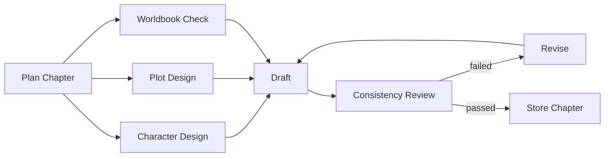
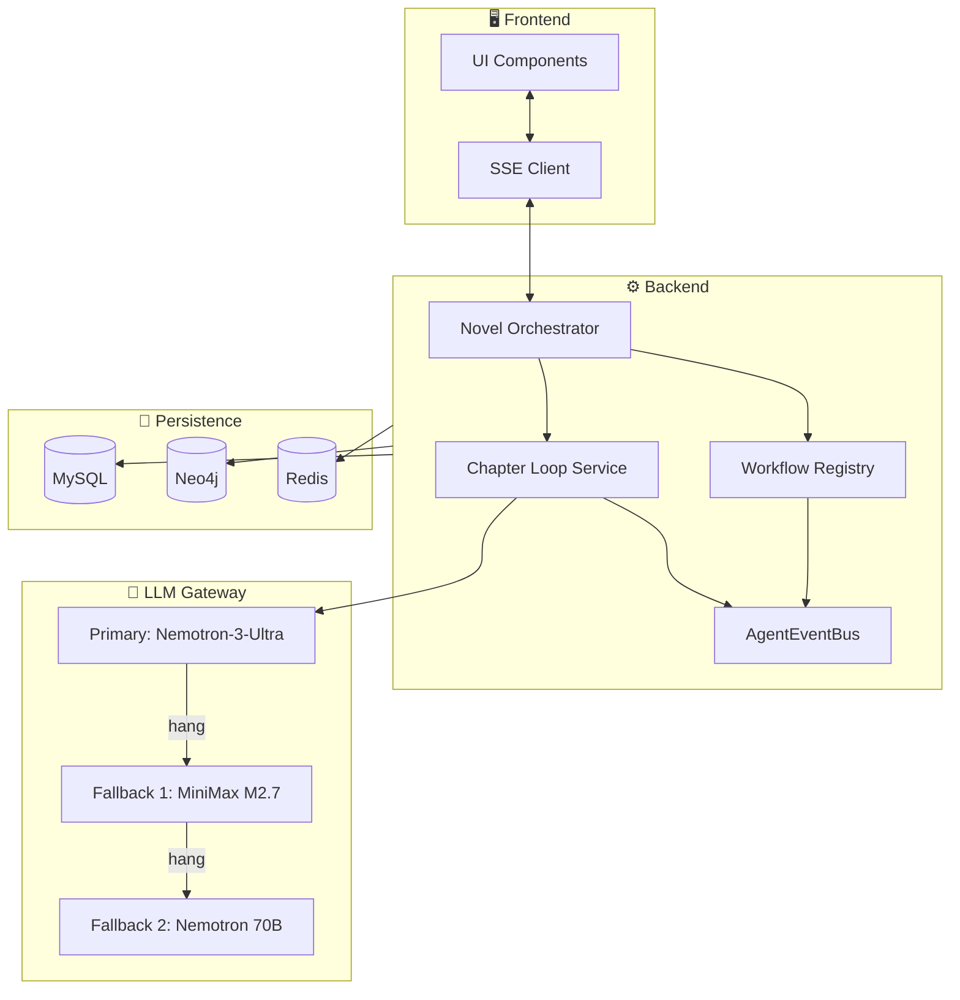

# ✒️ Mowen AI Editor

> 墨文 · 让 AI 陪你写完整本小说

**LangGraph 多智能体编排 · Plan-and-Execute · ReAct 反思循环 · Neo4j 故事图谱**

[](https://github.com/wanghaoyi216/Mowen-AI-Editor/stargazers)
[](https://github.com/wanghaoyi216/Mowen-AI-Editor/network)
[](LICENSE)
[](https://www.python.org)
[](https://www.typescriptlang.org)
[](https://fastapi.tiangolo.com)
[](https://react.dev)
[](https://github.com/langchain-ai/langgraph)

---

## 📑 目录

- [🎬 项目简介](#-项目简介)
- [⚡ 核心亮点](#-核心亮点)
- [🏗️ 架构总览](#-架构总览)
- [🚀 快速开始](#-快速开始)
- [🧩 工作流注册表](#-工作流注册表)
- [📸 功能页面](#-功能页面)
- [🔌 API 速览](#-api-速览)
- [🛠️ 开发与排障](#-开发与排障)
- [📂 项目结构](#-项目结构)
- [🗺️ 路线图](#-路线图)
- [🤝 贡献](#-贡献)
- [📜 许可证](#-许可证)

---

## 🎬 项目简介

| 🧠 1M 上下文 | 🔄 断点续跑 | 📡 实时事件 | 🎨 6 套主题 | 🕸️ 知识图谱 |
|:---:|:---:|:---:|:---:|:---:|
| Nemotron-3-Ultra | 进程崩了不丢稿 | SSE 推流 | 水墨风自定义 | Neo4j 关系网 |

**Mowen AI Editor** 是一个面向长篇小说的 **AI 协同创作平台**。从世界观构建、章节规划到正文生成，全流程由 LangGraph 编排的多智能体完成；前端用 6 套水墨主题打造沉浸式写作环境；后端任务断点续跑不丢稿，多模型自动降级保稳定。

不是聊天框 — 是 **写作操作系统**。


---

## ⚡ 核心亮点

### 🎯 1. Plan-and-Execute 工作流注册表

[workflow_registry_service.py](backend/app/services/workflow_registry_service.py) 注册式设计，新增工作流不改前端/路由：

| ID | 名称 | 步骤 |
|---|---|---|
| `wf-01` | 热点搜索 | Plan → Search → Store |
| `wf-02` | 世界观设计 | Plan → Design → Store |
| `wf-03` | 章节规划 | Plan → Strategize → Store |
| `wf-04` | 写作策略 | Plan → Decide → Store |
| `wf-05` | 章节生成循环 | Plan → Draft → Revise |

### 🧠 2. LangGraph StateGraph + 并行 SubAgent

[chapter_loop_service.py](backend/app/services/chapter_loop_service.py) 把章节生成拆成 **并行 SubAgent + ReAct 反思循环**：



### 📡 3. AgentEventBus 实时事件流

[agent_event_bus.py](backend/app/services/agent_event_bus.py) 进程内总线，前端 SSE 订阅：

- 🔧 `tool_call` / `tool_result` — 联网搜索 / Neo4j 查询
- 💭 `thinking` — Reasoning 模型思考过程
- ✍️ `text_delta` — 流式 token
- 📊 `progress` — 步骤进度

### 🔄 4. 任务 Checkpoint + 断点续跑

[task_persistence_service.py](backend/app/services/task_persistence_service.py) 把进度持久化到 MySQL：

- ✅ 每次 LLM 调用前写 checkpoint
- 🚨 进程崩/容器重启自动 `paused`
- 🛠️ 运维端点 `POST /projects/tasks/cleanup-orphans`
- ▶️ 用户可 `POST /projects/{id}/tasks/{tid}/resume` 续跑

### 🎛️ 5. 多模型自动降级

[openrouter_client.py](backend/app/integrations/openrouter_client.py) 双超时 + 快速切换：

| 超时类型 | 主模型 | Fallback |
|---|---|---|
| 首字节 (FB) | 10s | 20s |
| 整体 (RTT) | 60s | 60s |
| 重试 | ❌ 不重试 | ❌ 不重试 |

模型 hung 死 → **20s 内**切到下一个。

### 🎨 6. 6 套水墨主题

| 主题 | 主色 | 风格 |
|---|---|---|
| 墨韵默认 | `#2a2a2a` | 经典水墨 |
| 青玉 | `#0e7490` | 山水画卷 |
| 月竹 | `#365314` | 静谧夜林 |
| 梦墨 | `#6b21a8` | 玄奥意境 |
| 朱枫 | `#b91c1c` | 暖秋丹枫 |
| 自定义上传 | — | 颜色自动提取 |

### 🕸️ 7. Neo4j 知识图谱

角色、事件、地点、势力的多对多关系；章节生成时自动查询前文相关节点作为上下文（避免 LLM 失忆）；前端用 [react-force-graph](https://github.com/vasturiano/react-force-graph) 渲染力导向图。

---

## 🏗️ 架构总览



详细分层见 [docs/ARCHITECTURE.md](docs/ARCHITECTURE.md)。

---

## 🚀 快速开始

### 📋 前置依赖

| 工具 | 版本 | 说明 |
|---|---|---|
| Docker Desktop | 4.x+ | WSL2 backend |
| NVIDIA API Key | — | [build.nvidia.com](https://build.nvidia.com) 注册，免费 40/分钟 |
| 内存 | 8GB+ | Neo4j 占大头 |

### 🛠️ 三步启动

```bash
# 1️⃣ 克隆
git clone https://github.com/wanghaoyi216/Mowen-AI-Editor.git
cd Mowen-AI-Editor

# 2️⃣ 配置
cp backend/.env.example backend/.env
# 编辑 backend/.env，填入 NVIDIA_API_KEY

# 3️⃣ 一键起 4 个服务
docker compose up -d
```

### 🌐 服务清单

| 服务 | 地址 |
|---|---|
| 前端 | http://localhost:5173 |
| 后端 API | http://localhost:8000 |
| API 文档 | http://localhost:8000/docs |
| Neo4j Browser | http://localhost:7474 |

### 🔑 默认登录

```
账号: text
密码: 123456
```

---

## 🧩 工作流注册表

新增工作流只需在 [workflow_registry_service.py](backend/app/services/workflow_registry_service.py) 加一行：

```python
WORKFLOW_REGISTRY["wf-06"] = WorkflowDefinition(
    workflow_id="wf-06",
    name="Story Rewrite",
    description="对已写章节做风格重写",
    steps=[
        WorkflowStepDefinition(1, "Plan",   "分析章节风格",        "风格画像"),
        WorkflowStepDefinition(2, "Execute","重写章节正文",         "新章节"),
        WorkflowStepDefinition(3, "Store",  "写入 ChapterVersion",  "version_id"),
    ],
)
```

调用：`POST /api/v1/projects/{project_id}/workflows/wf-06/execute`

---

## 📸 功能页面

| 页面 | 预览 | 说明 |
|---|---|---|
| 主题选择 |  | 6 套水墨主题 |
| 故事总览 |  | 项目元信息 + 章节进度 |
| 新建项目 |  | 书名/简介/章节数 |
| 热点搜索 |  | 输入关键词跑灵感 |
| 章节写作 |  | 实时流式 token + 改写 |
| AI 执行 |  | 任务进度条 + 步骤状态 |
| 一致性检查 |  | Reviewer 报告 |
| 故事图谱 |  | Neo4j 力导向图 |
| 全局统计 |  | token 用量/字数 |

---

## 🔌 API 速览

<details>
<summary>📂 点击展开 14 个核心端点</summary>

| Method | Path | 用途 |
|---|---|---|
| `POST` | `/api/v1/auth/login` | 🔐 登录拿 JWT |
| `POST` | `/api/v1/auth/register` | 📝 注册 |
| `GET` | `/api/v1/projects` | 📂 列项目 |
| `POST` | `/api/v1/projects` | ➕ 新建项目 |
| `GET` | `/api/v1/projects/{id}/workflows` | 🧩 列工作流 |
| `POST` | `/api/v1/projects/{id}/workflows/{wid}/execute` | ▶️ 执行工作流 |
| `GET` | `/api/v1/projects/{id}/tasks` | 📋 列任务 |
| `GET` | `/api/v1/projects/{id}/tasks/{tid}` | 🔍 任务详情 |
| `POST` | `/api/v1/projects/{id}/tasks/{tid}/resume` | ▶️ 续跑 |
| `POST` | `/api/v1/projects/tasks/cleanup-orphans` | 🛠️ 清理孤儿任务 |

完整 Schema：[docs/openapi.json](docs/openapi.json)

</details>

---

## 🛠️ 开发与排障

### ⚙️ 常用命令

```bash
# 📜 实时看 API 日志
docker logs novel_ai_api --tail 200 -f

# 🐚 进 API 容器调试
docker exec -it novel_ai_api bash

# 🔨 改代码后重新 build
docker compose build api && docker compose up -d api

# 🧪 跑单测
cd backend && pytest -q
```

### 🚨 排障清单

| 🔴 症状 | 🔍 排查 |
|---|---|
| 任务卡 `running` | 调 `/cleanup-orphans` → 再 resume |
| AI 60s 不返回 | 日志搜 `absolute deadline exceeded` |
| LLM 401/403 | 检查 `.env` 的 `NVIDIA_API_KEY` |
| Neo4j 连不上 | `docker logs novel_ai_neo4j` |

---

## 📂 项目结构

```text
.
├── backend/
│   ├── app/
│   │   ├── api/routes/       # FastAPI 路由
│   │   ├── services/         # 业务服务
│   │   │   ├── workflow_registry_service.py   # 工作流注册
│   │   │   ├── chapter_loop_service.py        # SubAgent DAG
│   │   │   ├── task_persistence_service.py    # checkpoint
│   │   │   └── agent_event_bus.py             # 事件流
│   │   ├── integrations/     # 外部集成
│   │   └── core/             # 核心组件
│   └── requirements.txt
├── frontend/
│   └── src/
├── docs/                     # 文档
├── resource/Screenshot/      # README 截图
└── docker-compose.yml
```

---

## 🗺️ 路线图

- [x] ✅ v1.0 — MVP：项目管理 + 单工作流 + LLM 调用
- [x] ✅ v1.1 — 6 套水墨主题 + 颜色提取 + 自定义上传
- [x] ✅ v1.2 — 任务断点续跑 + 多模型降级 + 实时事件流
- [ ] 🚧 v2.0 — 多人协作 + 评论批注
- [ ] 🚧 v2.1 — 章节自动配图（SDXL）
- [ ] 💭 v3.0 — 多语言小说

---

## 🤝 贡献

欢迎 PR/Issue！

```bash
git checkout -b feat/awesome-feature
git commit -m "feat: add awesome feature"
git push origin feat/awesome-feature
```

---

## 📜 许可证

仅供学习和研究使用。

---

**如果这个项目对你有帮助，欢迎 ⭐ Star 支持开发！**

[🐛 报告 Bug](https://github.com/wanghaoyi216/Mowen-AI-Editor/issues) · [💡 功能建议](https://github.com/wanghaoyi216/Mowen-AI-Editor/issues)

---

_Powered by LangGraph · NVIDIA integrate API · Neo4j_
