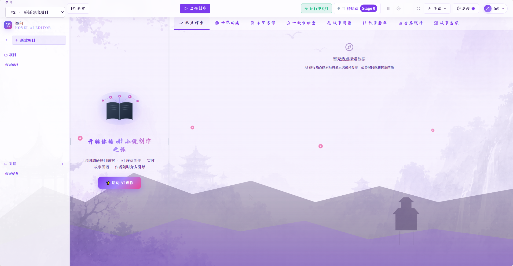

# Mowen AI Editor · 墨文 AI 编辑器

> 一个面向长篇小说的 AI 协同创作平台，基于 LangGraph 多智能体编排 + 计划与执行（Plan-and-Execute）+ ReAct 反思循环，让作者从世界观构建、章节规划到正文写作全流程都能在 AI 辅助下完成。



---

## 目录

- [项目简介](#项目简介)
- [技术栈](#技术栈)
- [核心亮点](#核心亮点)
- [快速开始](#快速开始)
- [架构总览](#架构总览)
- [工作流注册表](#工作流注册表)
- [功能页面](#功能页面)
- [API 速览](#api-速览)
- [开发与排障](#开发与排障)
- [项目结构](#项目结构)

---

## 项目简介

Mowen AI Editor 是一个 **AI 协同小说创作平台**。用户在前端新建项目、定义世界观、规划章节、生成正文，并通过 6 套水墨主题自定义界面观感；后端通过 LangGraph 编排多个 SubAgent、ReAct 反思循环、Plan-and-Execute 工作流，把任务拆给大模型逐步完成。

设计目标：
- **长上下文**：主创作模型 1M token 上下文（NVIDIA Nemotron-3-Ultra），支持 45+ 章小说的连贯性
- **可恢复**：任务执行中的 checkpoint 持久化到 MySQL，进程崩了 / OOM / LLM 限流后可断点续跑
- **可观察**：AgentEventBus 把 tool_call / tool_result / thinking / text_delta 实时推给前端
- **可降级**：单模型失败按 fallback 列表自动切换，单卡 GPU 限流时仍能跑通

---

## 技术栈

| 类别 | 选型 | 备注 |
|---|---|---|
| 前端 | React 19 + Vite 6 + TypeScript 5.8 | 6 套水墨主题（颜色提取 + 自定义上传） |
| 后端 | FastAPI + SQLAlchemy 2 + Pydantic v2 | 异步 + 同步混合；daemon thread 跑长任务 |
| 智能体编排 | LangGraph 0.4.8 | StateGraph + parallel SubAgent + ReAct loop |
| 数据库 | MySQL 8.4 | 业务主库（项目、章节、任务、checkpoint） |
| 图数据库 | Neo4j 5.24 | 故事图谱（角色 / 事件 / 世界观关系） |
| 缓存 / 限流 | Redis 7 | AgentEventBus 进程内总线 + 跨容器待扩展 |
| LLM 网关 | OpenRouter / NVIDIA integrate API | 主模型 + N 个 fallback，自动切换 |
| 部署 | Docker Compose（4 服务：web / api / mysql / neo4j） | 一键起 |

---

## 核心亮点

### 1. Plan-and-Execute 工作流注册表

5 套注册式工作流（[workflow_registry_service.py](backend/app/services/workflow_registry_service.py)），每套都有独立的 `Plan → Execute → Store` 步骤：

| Workflow ID | 名称 | 用途 |
|---|---|---|
| `wf-01` | Trend Hot Search | 规划搜索平台 / 关键词 / 分析维度 → 抓取热点 → 生成灵感报告 |
| `wf-02` | World Building | 规划世界观设计方案 → 生成种族 / 地理 / 势力 |
| `wf-03` | Chapter Planning | 决定章节总数和叙事策略 → 生成 ChapterPlan 列表 |
| `wf-04` | Writing Strategy | 决定顺序写 / 主干先写 / 混合 → 选最佳策略 |
| `wf-05` | Chapter Loop | Plan-and-Execute 编排：每章走 plan → draft → consistency → revise |

入口：`POST /api/v1/projects/{project_id}/workflows/{workflow_id}/execute`

### 2. LangGraph StateGraph + 并行 SubAgent

[chapter_loop_service.py:1-13](backend/app/services/chapter_loop_service.py#L1-L13) 用 `StateGraph` 编排 **并行的 SubAgent**：

```
                 ┌─ character_design  ─┐
                 ├─ plot_design       ─┼─→  revise (conditional)
                 └─ worldbook_check   ─┘            │
                                                      ↓
                                store_chapter  ←  ReAct loop (think → act → observe)
```

- **并行 SubAgent**：角色设计、剧情设计、世界观一致性 **同时跑**，最后 join
- **ReAct 反思循环**：每章正文先生成初稿 → LLM 反思 → 改写，最多 N 轮
- **条件分支**：一致性检查失败自动进 revise 节点；非关键失败走 fallback

### 3. AgentEventBus 实时事件流

[agent_event_bus.py](backend/app/services/agent_event_bus.py) 进程内总线，LLM 调用过程事件实时推给前端：

- `tool_call` / `tool_result` / `tool_error`（联网搜索、知识图谱查询等）
- `thinking`（reasoning 模型思考过程）
- `text_delta`（流式 token）

前端无需轮询即可看到 "AI 正在做 X / 完成 Y"。

### 4. 任务 checkpoint + 断点续跑

[backend/app/services/task_persistence_service.py](backend/app/services/task_persistence_service.py) + [backend/app/main.py on_startup](backend/app/main.py)：

- 每次 LLM 调用前把进度写到 MySQL
- 进程崩溃 / 容器重启时，on_startup 自动把 daemon thread 已死的 task 标为 `paused`
- 运维端点 `POST /api/v1/projects/tasks/cleanup-orphans` 兜底
- 用户可对单个 task 调 `POST /api/v1/projects/{project_id}/tasks/{task_id}/resume` 续跑

### 5. 多模型自动降级

[openrouter_client.py](backend/app/integrations/openrouter_client.py) + [openrouter_service.py](backend/app/services/openrouter_service.py)：

- Primary 模型 + 多个 fallback，按序尝试
- **首字节超时**（`NVIDIA_PRIMARY_FIRST_BYTE_TIMEOUT_SECONDS`）+ **整体超时**双保险
- `FirstByteTimeout` 不重试（同类错误重试浪费时间），直接切下一个模型
- 模型 hung 死时 **20s 内**切到下一个，不会让用户等满 5×60s

### 6. 6 套水墨主题系统


- 墨韵默认 / 青玉 / 月竹 / 梦墨 / 朱枫 / 用户自定义上传
- 颜色自动提取作为 CSS 变量
- 自定义上传走 base64 → IndexedDB 持久化

### 7. 知识图谱（Neo4j）


- 角色、事件、地点、势力的多对多关系
- 章节生成时自动查询前文相关节点作为上下文（避免 LLM 失忆）
- 前端用 [react-force-graph](https://github.com/vasturiano/react-force-graph) 渲染

---

## 快速开始

### 前置依赖

- Docker Desktop（WSL2 backend）
- NVIDIA API key（[build.nvidia.com](https://build.nvidia.com) 注册即可，免费 40 次/分钟）
- 8GB+ 内存

### 启动

```bash
# 克隆
git clone https://github.com/wanghaoyi216/Mowen-AI-Editor.git
cd Mowen-AI-Editor

# 配置环境变量
cp backend/.env.example backend/.env
# 编辑 backend/.env，填入 NVIDIA_API_KEY

# 一键起 4 个服务
docker compose up -d
```

服务起来后：

| 服务 | 地址 | 备注 |
|---|---|---|
| 前端 | http://localhost:5173 | 开发模式热更新；生产 build 由 `docker-compose.yml` 的 `web` 服务托管 |
| 后端 API | http://localhost:8000 | OpenAPI 文档在 `/docs` |
| MySQL | localhost:3306 | 用户 `novel_ai` / 库 `novel_ai_editor` |
| Neo4j Browser | http://localhost:7474 | 用户 `neo4j` / 密码见 `.env` |

### 首次登录

默认账号 `text` / 密码 `123456`（`.env` 可改），首次启动自动建表 + 写入种子数据。

### 跑通一个完整任务

1. 登录后点 **新建项目**，填书名、简介、章节数
2. 切到 **世界构建** 标签，触发 `wf-02`，生成世界观
3. 切到 **章节写作**，触发 `wf-05`，从第 1 章开始生成
4. 实时看到 AI 自动执行阶段：


5. 完成后切到 **一致性检查**：


---

## 架构总览

```
┌─────────────────────────────────────────────────────────────────────┐
│                         Frontend (React 19 + Vite 6)                 │
│  ┌──────────┐ ┌──────────┐ ┌──────────┐ ┌──────────┐ ┌──────────┐  │
│  │ 主题切换  │ │ 项目管理 │ │ 工作流   │ │ 章节写作  │ │ 故事图谱  │  │
│  └──────────┘ └──────────┘ └──────────┘ └──────────┘ └──────────┘  │
│            ▲                                                          │
│            │ SSE / REST (AgentEventBus 推流)                          │
└────────────┼─────────────────────────────────────────────────────────┘
             │
             ▼
┌─────────────────────────────────────────────────────────────────────┐
│                      Backend (FastAPI + LangGraph)                   │
│                                                                       │
│  ┌──────────────────┐  ┌──────────────────┐  ┌──────────────────┐  │
│  │  workflow_       │  │  novel_           │  │  chapter_loop_   │  │
│  │  registry        │  │  orchestrator     │  │  service         │  │
│  │  (Plan→Exec)     │  │  (3-Phase)        │  │  (SubAgent DAG)  │  │
│  └────────┬─────────┘  └────────┬─────────┘  └────────┬─────────┘  │
│           │                       │                       │           │
│           └───────────────────────┴───────────────────────┘           │
│                                   │                                    │
│                                   ▼                                    │
│           ┌─────────────────────────────────────────────┐             │
│           │  OpenRouter Client (Primary + Fallback)     │             │
│           │  · first_byte_timeout + absolute deadline   │             │
│           │  · FirstByteTimeout → no_retry              │             │
│           └────────────────────┬────────────────────────┘             │
│                                │                                       │
│  ┌─────────────────────────────┼─────────────────────────────────┐   │
│  │  Persistence Layer         ▼                                    │   │
│  │  ┌─────────────┐  ┌─────────────┐  ┌─────────────┐            │   │
│  │  │   MySQL     │  │    Neo4j    │  │    Redis    │            │   │
│  │  │ 业务+checkpt│  │ 故事图谱    │  │ 限流+缓存   │            │   │
│  │  └─────────────┘  └─────────────┘  └─────────────┘            │   │
│  └────────────────────────────────────────────────────────────────┘   │
└─────────────────────────────────────────────────────────────────────┘
```

详细分层见 [docs/ARCHITECTURE.md](docs/ARCHITECTURE.md)。

---

## 工作流注册表

新增工作流只需要在 [workflow_registry_service.py](backend/app/services/workflow_registry_service.py) 加一项 `WORKFLOW_REGISTRY["wf-NN"] = WorkflowDefinition(...)`，无需改前端 / 路由：

```python
WORKFLOW_REGISTRY["wf-06"] = WorkflowDefinition(
    workflow_id="wf-06",
    name="Story Rewrite",
    description="对已写章节做风格重写",
    steps=[
        WorkflowStepDefinition(1, "Plan",   "分析章节风格",      "风格画像",   ["llm_generate"]),
        WorkflowStepDefinition(2, "Execute","重写章节正文",       "新章节",     ["llm_generate"]),
        WorkflowStepDefinition(3, "Store",  "写入 ChapterVersion", "version_id", ["query_sqlite"]),
    ],
)
```

执行：`POST /api/v1/projects/{project_id}/workflows/wf-06/execute`

---

## 功能页面

| 页面 | 截图 | 说明 |
|---|---|---|
| 登录 |  | 邮箱 + 密码，JWT 认证 |
| 主题选择 |  | 6 套水墨主题，提取主色 |
| 故事总览 |  | 项目元信息 + 章节进度条 |
| 新建项目 |  | 书名 / 简介 / 章节数 / 主题 |
| 热点搜索 |  | wf-01 输入关键词跑灵感 |
| 章节写作 |  | 实时流式 token + 改写按钮 |
| AI 自动执行 |  | 任务进度条 + 步骤状态 |
| AI 规划详情 |  | Plan-and-Execute 步骤明细 |
| 一致性检查 |  | Reviewer 报告 |
| 故事图谱 |  | Neo4j 力导向图 |
| 故事脉络 |  | 时间线视图 |
| 全局统计 |  | token 用量 / 章节字数 |

---

## API 速览

| Method | Path | 用途 |
|---|---|---|
| `POST` | `/api/v1/auth/login` | 登录拿 JWT |
| `POST` | `/api/v1/auth/register` | 注册 |
| `GET`  | `/api/v1/projects` | 列项目 |
| `POST` | `/api/v1/projects` | 新建项目 |
| `GET`  | `/api/v1/projects/{id}/workflows` | 列出该项目可用工作流 |
| `POST` | `/api/v1/projects/{id}/workflows/{wid}/execute` | 执行工作流 |
| `GET`  | `/api/v1/projects/{id}/tasks` | 列任务 |
| `GET`  | `/api/v1/projects/{id}/tasks/{tid}` | 任务详情 |
| `GET`  | `/api/v1/projects/{id}/tasks/{tid}/steps` | 步骤状态 |
| `GET`  | `/api/v1/projects/{id}/tasks/{tid}/logs` | 执行日志 |
| `POST` | `/api/v1/projects/{id}/tasks/{tid}/pause` | 暂停 |
| `POST` | `/api/v1/projects/{id}/tasks/{tid}/resume` | 续跑（断点恢复） |
| `POST` | `/api/v1/projects/tasks/cleanup-orphans` | 运维：清理孤儿任务 |
| `GET`  | `/api/v1/projects/{id}/llm-stats` | LLM 用量统计 |

完整 OpenAPI Schema 在 `docs/openapi.json`，或部署后访问 `/docs`。

更多 cheat sheet：[docs/API_CHEATSHEET.md](docs/API_CHEATSHEET.md)

---

## 开发与排障

### 常用命令

```bash
# 查看 API 容器日志（实时）
docker logs novel_ai_api --tail 200 -f

# 进入 API 容器调试
docker exec -it novel_ai_api bash

# 重新 build API（代码改动后）
docker compose build api && docker compose up -d api

# 跑单测
cd backend && pytest -q

# 前端热更新
cd frontend && npm run dev
```

### 排障清单

| 症状 | 排查 |
|---|---|
| 任务卡在 `running` 不动 | 调 `POST /api/v1/projects/tasks/cleanup-orphans`（清理孤儿）→ 再调 resume |
| AI 一直 60s 不返回 | 看 API 日志搜 `absolute deadline exceeded`，说明模型 hung，已自动切 fallback |
| LLM 报 401/403 | 检查 `.env` 的 `NVIDIA_API_KEY` 是否过期（NVIDIA key 90 天滚动） |
| Neo4j 连不上 | `docker logs novel_ai_neo4j` 看是否启动完成（首次启动要 30s+） |
| 主题不切换 | 浏览器 console 看 `localStorage.getItem('theme')` 是否有值 |

更详细的运维手册：[docs/OPERATIONS.md](docs/OPERATIONS.md)

---

## 项目结构

```
.
├── backend/
│   ├── app/
│   │   ├── api/routes/        # FastAPI 路由
│   │   │   ├── auth.py
│   │   │   ├── projects.py
│   │   │   ├── workflows.py   # 工作流执行入口
│   │   │   ├── tasks.py       # 任务 CRUD + resume + cleanup-orphans
│   │   │   └── chapters.py
│   │   ├── services/
│   │   │   ├── workflow_registry_service.py   # 5 套工作流注册
│   │   │   ├── novel_orchestrator_service.py # 3-Phase 主编排
│   │   │   ├── chapter_loop_service.py        # SubAgent DAG + ReAct
│   │   │   ├── ai_workflow_graph_service.py   # Plan-and-Execute
│   │   │   ├── task_persistence_service.py    # checkpoint / orphan
│   │   │   ├── agent_event_bus.py             # 进程内事件流
│   │   │   ├── openrouter_service.py          # 模型候选 + fallback
│   │   │   └── ...
│   │   ├── integrations/
│   │   │   └── openrouter_client.py           # 含 absolute deadline
│   │   ├── core/
│   │   │   ├── config.py                      # Pydantic Settings
│   │   │   └── resilience.py                  # with_retries + no_retry
│   │   └── main.py                            # FastAPI app + on_startup
│   ├── .env.example
│   └── requirements.txt
├── frontend/
│   ├── src/
│   │   ├── components/         # 主题切换 / 项目卡片 / 工作流面板
│   │   ├── pages/              # Login / Project / Chapter / Graph
│   │   ├── stores/             # Zustand: theme / auth / task
│   │   └── api/                # axios 封装 + SSE 订阅
│   └── package.json
├── docs/
│   ├── ARCHITECTURE.md         # 详细架构
│   ├── DEPLOYMENT.md           # 部署指南
│   ├── OPERATIONS.md           # 运维手册
│   ├── API_CHEATSHEET.md       # API cheat sheet
│   └── openapi.json
├── resource/
│   └── Screenshot/             # README 用截图
├── docker-compose.yml          # web / api / mysql / neo4j
└── README.md                   # 你正在看这个
```

---

## 致谢

- [LangGraph](https://github.com/langchain-ai/langgraph) — 多智能体编排
- [NVIDIA integrate API](https://build.nvidia.com) — Nemotron / Llama 系列模型
- [react-force-graph](https://github.com/vasturiano/react-force-graph) — 故事图谱渲染
- [Vite](https://vitejs.dev) + [React 19](https://react.dev) — 前端栈

---

## 许可证

仅供学习和研究使用。
